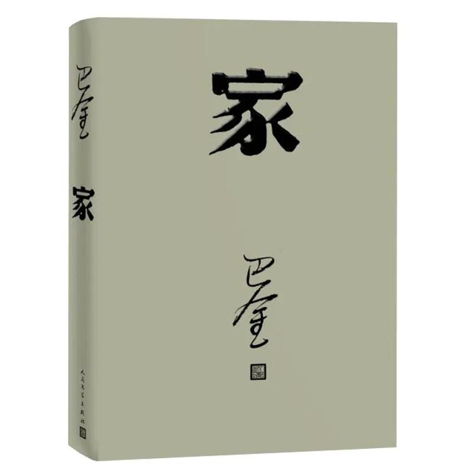
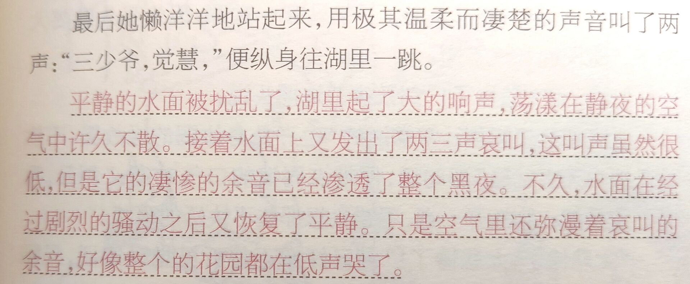
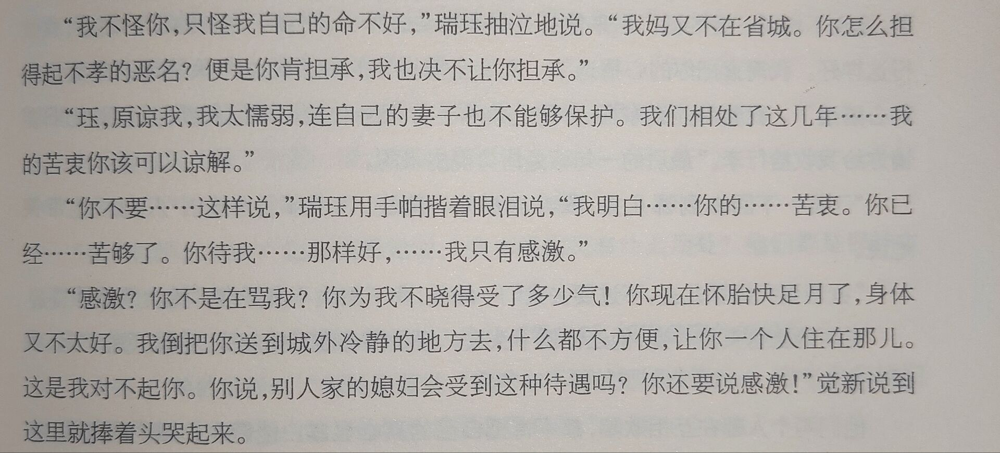
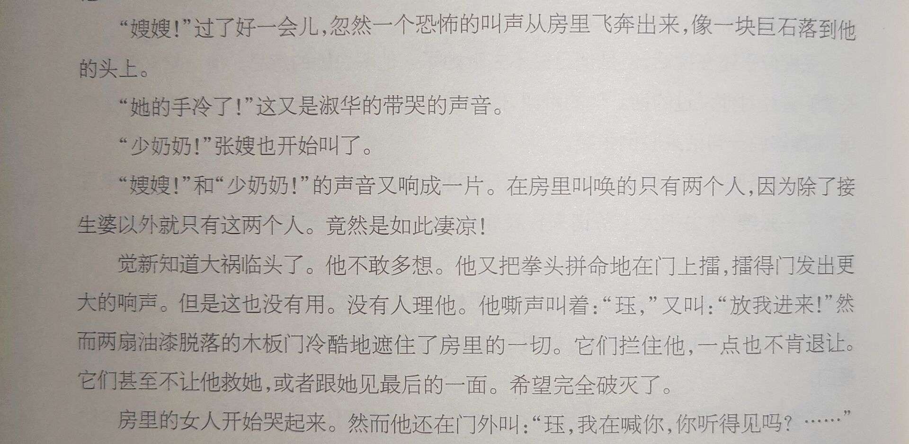

### 前言

《家》是中国作家巴金的长篇小说，《激流三部曲》中的第一部，被认为是巴金的代表作之一，入选20世纪中文小说100强（第8位）。该小说描写了20世纪20年代初期四川成都一个封建大家庭的罪恶及腐朽，控诉了封建制度对生命的摧残，歌颂青年一代的反封建斗争以及民主主义的觉醒。

### 主要人物

**觉新**，高家的长房长孙，觉民、觉慧的大哥，是一个长期接受封建教育，深受封建礼教制度的迫害，但又渴望幸福生活，具有“二重人格的人”。

**觉民**，高家二少爷，琴的恋人，受“五四”新思想影响的青年学生。

**觉慧**，受“五四”新思想影响的青年学生代表。

**高老太爷**，封建家长的代表，觉新、觉民和觉慧的爷爷。

**琴**，受“五四”新思想影响的青年学生，觉民的恋人。

**鸣凤、梅、李瑞珏**，深受封建礼教制度迫害的悲惨人物。

### 令我印象深刻的片段

#### 鸣凤的死：

高老太爷把鸣凤像送东西一样赠给冯乐山做小妾。鸣凤怀着一线希望去找觉慧，埋头写文章的觉慧丝毫没有察觉到鸣凤脸色的变化，鸣凤几次欲言又止，鸣凤只好流着泪离去。鸣凤在绝望与希望之间挣扎，最后，鸣凤喊着觉慧的名字投湖自尽了。她死后，婉儿流着泪顶替她做了冯乐山的小妾。

觉民说：“想不到爷爷这样狠心！一个死了，还要把另一个送出去。”鸣凤死得如此凄惨，并没有换来多少人的同情与在意，体现了封建礼教制度的根深蒂固，高老太爷以及其他人的冷漠无情。

#### 高老太爷的死：

高老太爷病倒了，但他的病并没给这个家庭带来什么大的变化。各房的人们依旧在笑、在哭、在吵架、在争斗。看到医药已经对他的病产生不了什么效力，陈姨太和克明三兄弟便去请来道士，拜菩萨、祭天、捉鬼，闹得一塌糊涂，使高老太爷的病雪上加霜。去世后，第二天，高家兄弟们就为财产分割的事情吵了起来。

团团围坐的封建大家庭根本没有什么亲情可言，更多的是利益纷争，高老太爷尸骨未寒，三个儿子已经开始争夺家产，反映出这个封建大家庭的悲哀。

#### 觉新的懦弱和瑞珏的死：

瑞珏生产第二个孩子的日期就要到了。嫉妒、憎恨瑞珏的陈姨太借口“血光之灾”，要求瑞珏去城外生养。高家克字辈担心背上不孝的骂名，也对陈姨太的办法予以赞成，他们让觉新照办。觉民、觉慧劝哥哥反抗，但觉新却流着泪答应了这一切。瑞珏只好搬到城外一间久已没人住过的又阴暗又潮湿的小屋里去生产。四天后，觉新来看瑞珏，正听到她在屋里凄惨的喊叫声，觉新想冲进去守在她身边，陈姨太却吩咐不许觉新进产房，没有人敢来为他开门。瑞珏叫着觉新的名字痛苦地死去了，两人临死都未能见上最后一面。觉新终于醒悟，夺去他心爱的两个女人正是“全个礼教，全个传统，全个迷信”。但他仍然没有决心反抗。

### 总结

在《家》中，有许多青年女性的不幸遭遇：梅的抑郁致死；瑞珏的惨痛命运；鸣凤的投湖悲剧；婉儿的被逼出嫁，这些无不是封建制度以及礼教、迷信迫害的结果。通过这些故事，作家批判的锋芒不仅指向旧礼教，更指向作为封建统治核心的专制主义。